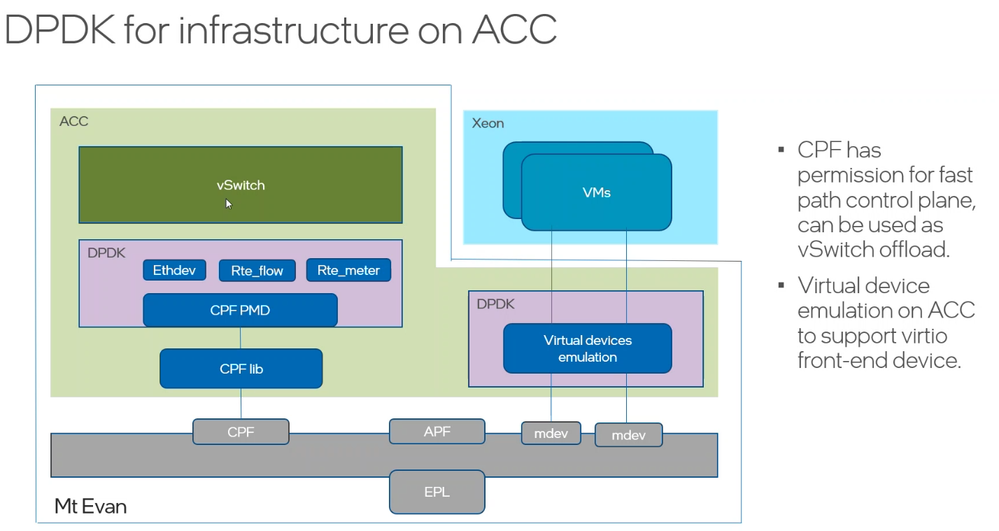
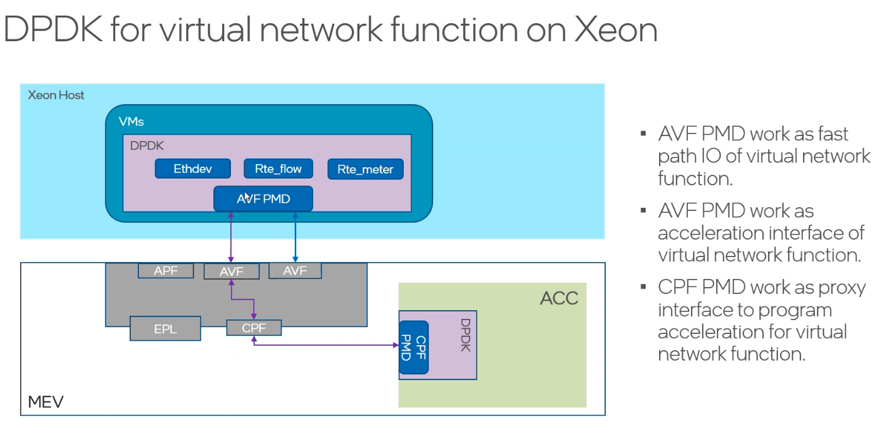
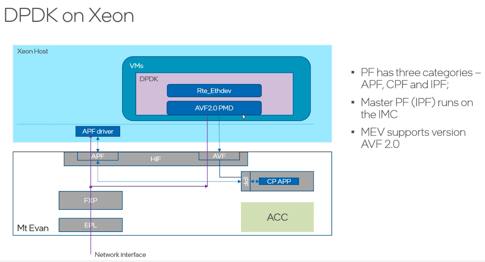

| Column 1           | Column 2           | Column 3           |
|--------------------|--------------------|--------------------|
| idpf(apf driver)   | PF和VF使用          | Data 3             |
| cpfl（cpf driver）  | Hairpin queue      | port representor   |
| Data 7             | Data 8             | Data 9             |

| Column 1           | Column 2           | Column 3           |
|--------------------|--------------------|--------------------|
| APF                |                    | Data 3             |
| CPF                | has permission for |virtual device emulation 
|                    | fast path control plane| on ACC to support  |
|                                              |  virtio front end  |
| IPF                | Master PF  runs on IMC | Data 9             |

