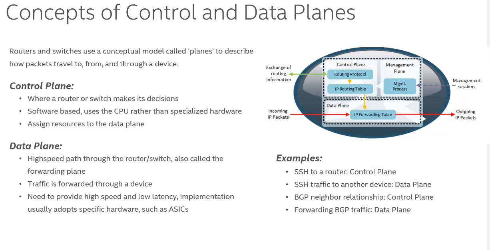
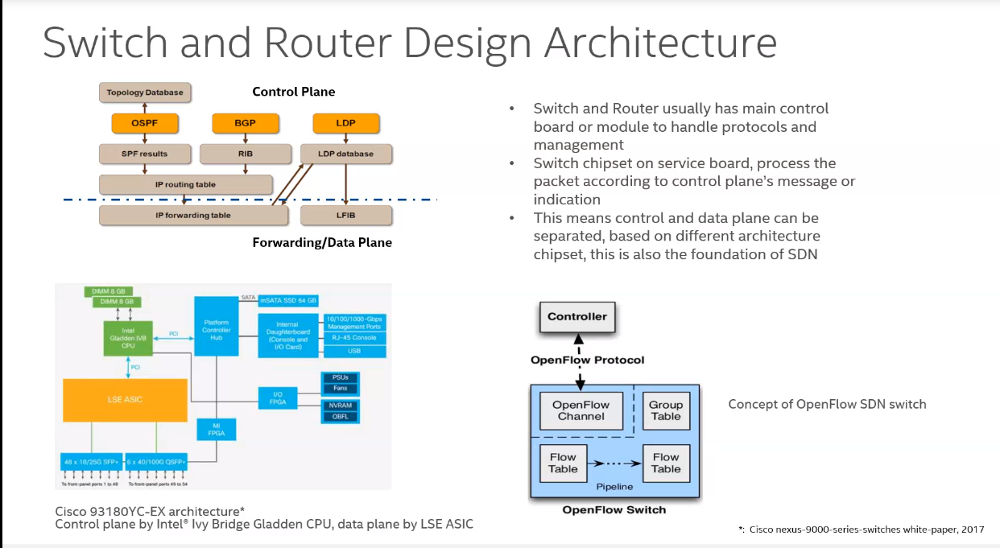

chipset introduction

控制面负责decision make

简化数据面协议处理，由控制面实现升级和开发

NP（network processor）
Switch ASIC

Programmable ASIC
 P4 Language:协议无关的

 Barefoot
 Tofino
 缺点：生态；容量；功耗高（可编程比固定的高）
 
 Broadcom的两款芯片（Jericho）
 
 Virtual switch

 Underlay: 二层转发